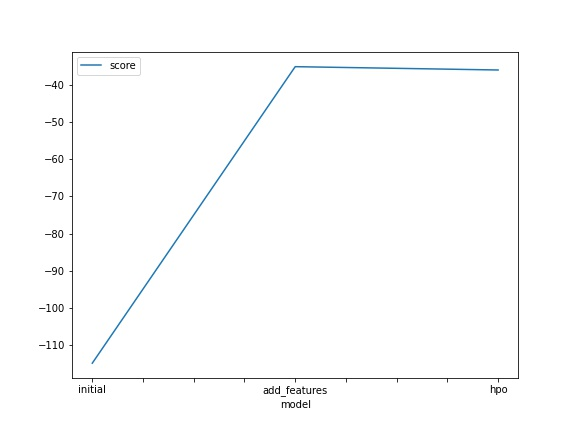
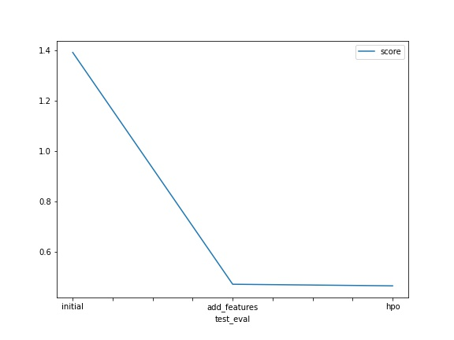

# Report: Predict Bike Sharing Demand with AutoGluon Solution
#### TEJAS SHANBHAG

## Initial Training
### What did you realize when you tried to submit your predictions? What changes were needed to the output of the predictor to submit your results?
Our ultimate goal in this case study was to predict the number of bikes.Hence this was an classic Regression Problem. However when I made the predictions on the test set, I noticed that there were some values which were negative. However this problems involves predicting the number of bikes and it can never be negative. Hence I had to manually cap the values to 0.So all the values which were less than 0 had to be converted to zero before submission!

### What was the top ranked model that performed?
The best model in my case was a **Weighted Ensemble L3**. A weighted Ensemble consists of several different algorithms and each one get a different weight.

## Exploratory data analysis and feature creation
### What did the exploratory analysis find and how did you add additional features?
After plotting histograms I could see that there were some columns like **weather** and **seasons** which should be treated as category.Also I could see that we had a date column.So instead of using date directly as a feature, it would be much better to create additional features such as :
- year
- month
- day
- hour

### How much better did your model preform after adding additional features and why do you think that is?
Originally the model was getting a Kaggle score of **1.39**. However after feature engineering the score was **0.47** which was much better. Deriving additional features like day , month, hour etc helped the model to find better patterns and features to predict the bike demand. Also we changed the data type to category which will help the model to treat season and weather as categories.

## Hyper parameter tuning
### How much better did your model preform after trying different hyper parameters?
After trying out different hyperparameters I could see that the score improved from 0.470 to 0.463. Although is is not a significant improvement, but hyperparameter tuning is important to further optimize the model. A couple of hyperparameters that I tuned was the training time, number of folds and stacking levels. The score improved slightly because the the model can see the entire dataset while evaluation because of the increased number of folds and not just one part as the test set.

### If you were given more time with this dataset, where do you think you would spend more time?
If I could get more time I will definitely increase the training time for the Autogluon as it will then try out several other models. Another thing would be to try different set of hyperparameters for the models. For eg in case of tree based models we could change the number of trees, maximum dpeth, number of splits etc. Also deriving new features based can significantly help to improve the model performance.

### Create a table with the models you ran, the hyperparameters modified, and the kaggle score.
|model|num_bag_folds|num_stack_levels|time_limit|score|
|--|--|--|--|--|
|initial|0|0|600|1.39194|
|add_features|0|0|600|0.47027|
|hpo|3|2|1000|0.46396|

### Create a line plot showing the top model score for the three (or more) training runs during the project.

### Create a line plot showing the top kaggle score for the three (or more) prediction submissions during the project.

## Summary
In this project we worked on a Kaggle competetion that involved predicting Bike share demand. Initially we created a model and could achieve a score of 1.39 on the leaderboard. However we incorporated several steps like Feature engineering and adding some new hyper-parameters and we could see an improvement in the overall score. This helps us conclude that feature Engineering and Hyperparameter tuning are one of the most critical steps in building an accurate Machine Learning model.
